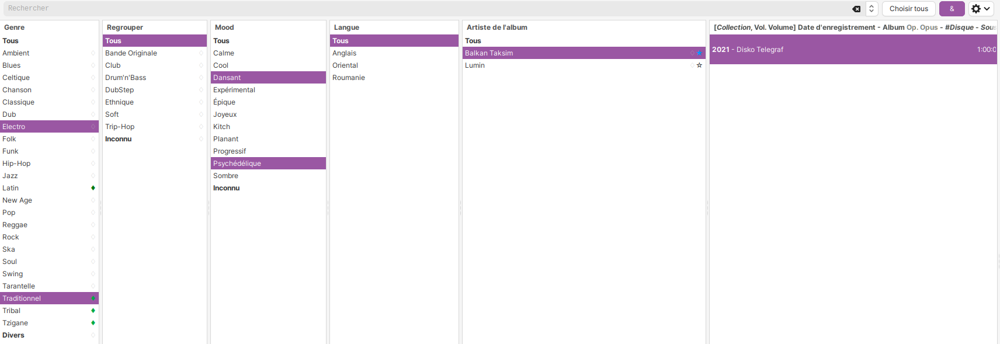
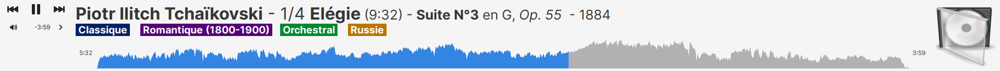
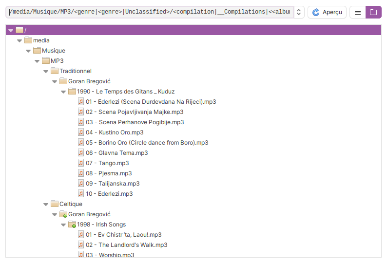

# Quodlibet Plugins 🛠️

My personal plugins for QuodLibet music software.

## Descriptions

### /events/

#### Conjunction

Filter your paned browser with multiple selections, using a **logical AND** instead of the default logical OR ; see [#4765](https://github.com/quodlibet/quodlibet/issues/4765).  
Ideal for multi-tagged songs (`<genre>`, `<grouping>`, `<language>`,etc).  
A button is added at the right hand top of the paned browser to switch between `AND` (`&`) and `OR` (`||`) logic.

#### WaveformSeekbar2

An improved version of the original **WaveformSeekbar** plugin, with two additional options:
* Displays only _half of the waveform_ (usually symmetrical, which is 50% wasted space)
* Applying _compression to the curve_ to better visualize quiet sounds (useful for pieces with high dynamics, such as classical music).

#### FadeOut

The **Fade-out** plugin allows you to stop your music smoothly by gradually lowering the volume instead of an abrupt cut.

**Main Features:**
- Full Control: Customize the fade duration (up to 30s) and choose the final action (Pause, Stop, or Quit).
- Smart Shortcut: Use the built-in recorder to set your preferred key combination (default: Ctrl+Shift+F).
- Clean Integration: Adds a dedicated "Stop with fade-out" entry directly into the Control menu.

### /editing/

#### RenamingTreeView

View your file tree when renaming your library

#### RenamingPathPrune

For path components containing multiple values (tags separated by commas) while renaming files, this plugin intelligently selects a single value based on defined preference and avoidance rules.

## Installing

* Copy the `.py` files into your personal QuodLibet plugins folder (usually `~/.config/quodlibet/plugins/` on Linux and Mac) with the corresponding subfolder (`editing`, `events`, `songsmenu`, etc.)  
* Relaunch Quodlibet

## ⚠️ Warnings

Some plugins use unconventionnal methods and deeply modify QuodLibet's code when active.  
They are therefore very dependent on a software version (v4.7.1 at the moment) and _may cause unexpected behavior_ with other versions: **use them at your own risk!**  
If you encounter any problems, simply delete the file from your plugins folder.

## Acknowledgments

* [QuodLibet (doc)](https://quodlibet.readthedocs.io/en/latest/)
* [QuodLibet (GitHub)](https://github.com/quodlibet/quodlibet)
